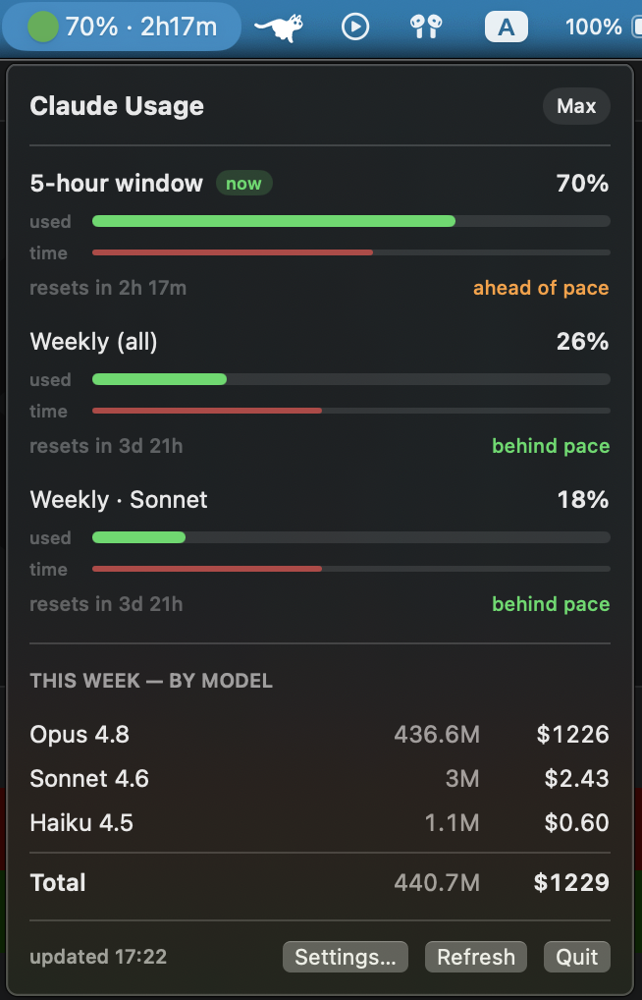

# Claude Usage Bar

[](https://github.com/icedumpy/claude-code-usage-bar/actions/workflows/ci.yml)

A native macOS menu bar app that shows your Claude Code usage at a glance — your
5-hour rate-limit headroom in the menu bar, weekly limits and a per-model
token/cost breakdown in the dropdown, and a notification before you hit a wall.

<p align="center">
  
</p>

## Features

- **Menu bar:** a colored dot (green / amber / red by severity) plus your
  usage. Choose what it shows — the limit **percentage**, the week's **dollar**
  value, or both (`47% · $1,612`) — and **which limit drives it** (the 5-hour
  window, a weekly limit, or "Auto" = whichever is most severe). Optional reset
  countdown.
- **Dropdown:** each rate-limit window (5-hour, weekly-all, weekly-per-model)
  with a usage bar and reset time, then a per-model token total and an
  API-equivalent dollar figure for the current week.
- **Visualization toggle:** show each limit as plain **bars**, or as a
  **rabbit-and-turtle race** — a rabbit (your usage) and a turtle (time elapsed
  in the window) on a shared track, so a glance tells you whether you're burning
  faster than the clock. Pick it in Settings; defaults to bars.
- **Pinned panel:** detach a chromeless, always-on-top "picture-in-picture"
  widget (the **Pin** button in the dropdown footer). It floats over every Space
  and fullscreen app without stealing focus, drags anywhere, resizes by its
  corner, and its opacity and which sections it shows are adjustable. Position
  and state persist across launches.
- **Alerts:** a macOS notification when a limit crosses a threshold
  (80% / 95% by default, adjustable).
- **Settings:** refresh interval, countdown toggle, what the menu bar shows and
  which limit drives it, alert thresholds, launch-at-login, the bars/race
  visualization, and the pinned panel's opacity and visible sections.
- **Quiet under load:** backs off automatically on rate-limit responses, and
  keeps showing last-known numbers instead of an error.

## How it works

Two data sources:

1. **Rate limits** — `GET https://api.anthropic.com/api/oauth/usage` with your
   Claude Code OAuth token (the same call `/usage` makes). The token is read
   from the macOS Keychain item `Claude Code-credentials`, which Claude Code
   keeps refreshed.
2. **Token/cost** — parses `~/.claude/projects/**/*.jsonl` transcripts,
   aggregating per-model token usage for the current weekly window and pricing
   it via `PriceTable` (public list prices, easy to edit).

Polls every 60s by default (configurable: 15s / 30s / 60s / 5m). The cost engine
caches parsed files by modification date, so steady-state polling stays cheap
even with a large transcript history.

The dollar figures are notional "value extracted" — on a flat-fee subscription
they're what the same tokens would cost on pay-as-you-go API pricing, not real
spend.

### Keychain access

The app reads the credential by invoking `/usr/bin/security`, which accesses the
Keychain item without a blocking permission dialog. (A freshly ad-hoc-signed app
is not in the item's trust list, so a direct Security-framework read would prompt
on every poll.)

## Requirements

- macOS 13 or later (Apple Silicon or Intel — the build is universal).
- The Swift toolchain. Xcode Command Line Tools is enough
  (`xcode-select --install`) — no full Xcode needed.
- **Claude Code installed and signed in with a Claude subscription.** The app
  reads usage from the OAuth token in your Keychain; pay-as-you-go API-key usage
  is not reported.

## Install

```sh
git clone https://github.com/icedumpy/claude-code-usage-bar.git
cd claude-code-usage-bar
./scripts/install.sh        # builds the universal .app, installs to /Applications, launches
```

First launch may show a Gatekeeper prompt (the app is ad-hoc signed, not
notarized): right-click the app in `/Applications` and choose **Open** once, or
run `xattr -dr com.apple.quarantine /Applications/ClaudeUsageBar.app`.

Open the dropdown, click **Settings…**, and enable **Launch at login** so it
starts with your Mac.

## Updating

```sh
git pull
./scripts/install.sh        # rebuilds and replaces the installed app
```

Your custom icons and settings live in
`~/Library/Application Support/ClaudeUsageBar/` and are **not** touched by an
update, so they survive upgrades.

## Privacy

The app has no embedded secrets and no server of its own. Your OAuth token is
read at runtime from *your* Keychain and sent only to Anthropic's API — exactly
as Claude Code does — never to the author or any third party. The token/cost
breakdown is computed entirely from local files on your machine.

## Custom icons

The menu bar icon is loaded from three SVG files (one per severity); drop in your
own art and it is picked up automatically (no rebuild):

```
~/Library/Application Support/ClaudeUsageBar/icons/
   normal.svg     # low usage   (green by default)
   warning.svg    # mid usage   (amber by default)
   critical.svg   # high usage  (red by default)
```

The app renders whatever SVG is in that folder. It is a normal user-writable
directory, so only put art you trust there (SVG contents are not sanitized
before rendering).

## Architecture

- `Sources/UsageCore/` — UI-free, unit-tested data layer: `UsageClient` (API),
  `CostEngine` (actor; JSONL parsing + caching), `Credentials` (token parsing),
  `PriceTable`, `ThresholdAlerter`, `UsageSnapshot`, `Formatting`, and
  `PinnedPanelGeometry` (pure clamp + on/off-screen logic for the pinned panel).
- `Sources/ClaudeUsageBar/` — SwiftUI app: `UsageStore` (`@MainActor`
  `ObservableObject` polling + backoff), `DropdownView` (with the bars/race
  visualization), `SettingsView`, `PinnedPanelController` / `PinnedPanelView`
  (the floating PiP panel), `NotificationManager`, `ShellCredentialProvider`,
  and `Probe` (`--probe` CLI).

## Other commands

```sh
swift test                              # run the unit tests (Swift Testing)
.build/release/ClaudeUsageBar --probe   # print what the menu bar would show
```

## Distributing

The repo is the simplest path — people clone and run `./scripts/install.sh`. For
a double-click, notarized download you would need an Apple Developer account
($99/yr) to Developer-ID-sign and notarize the `.app`. The default icons are
plain colored circles (original artwork, no third-party marks), so the repo is
safe to share as-is.

## Notes

- The `/api/oauth/usage` endpoint is undocumented, so an Anthropic change could
  break the rate-limit display. The token/cost breakdown reads local files and
  is unaffected.
- If your token expires while Claude Code is closed, the bar shows a warning
  state until you next use Claude Code (the app does not refresh the token
  itself).
- Update `PriceTable` when Anthropic's public prices change.

## License

MIT — see [LICENSE](LICENSE).
